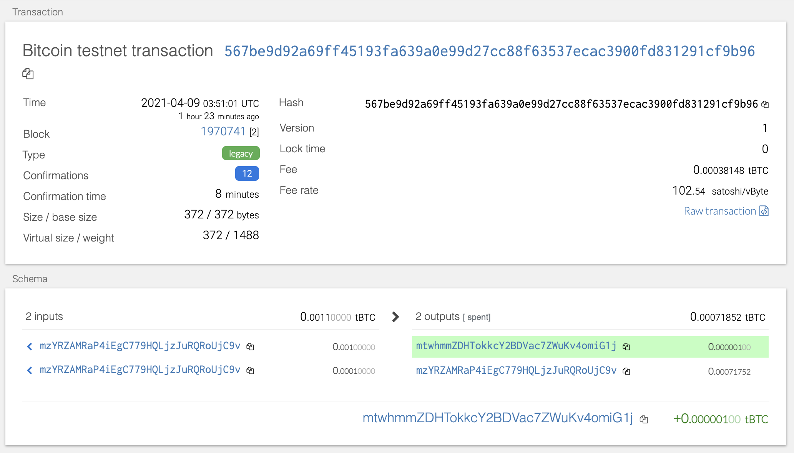
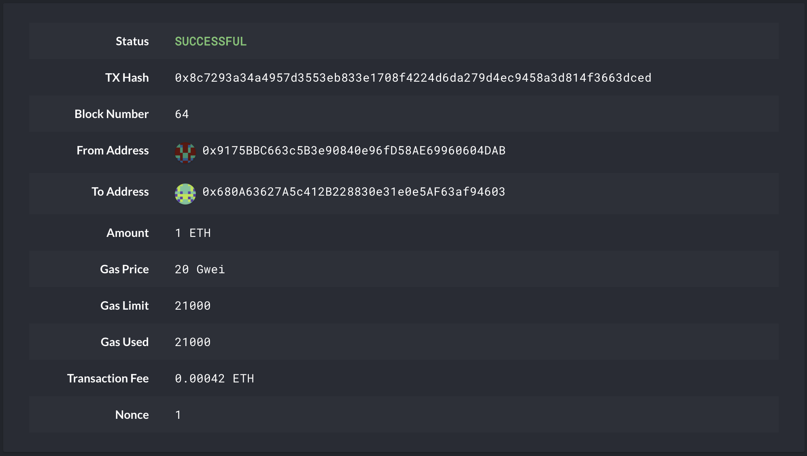

# Unit 19 Homework

## CryptoWallet

The CryptoWallet class provides functions to derive wallet addresses using a mnemonic phrase loaded from an environment variable, MNEMONIC. If MNEMONIC is not set, a default mnemonic phrase is used. The class also includes functions convert a private key to an Account object and to send transactions.

The class is built using [eth-account](https://github.com/ethereum/eth-account), [bit](https://github.com/ofek/bit), [Web3.py](https://web3py.readthedocs.io/en/stable/), and [hd-wallet-derive](https://github.com/dan-da/hd-wallet-derive).

**eth-account**. This package provides a way to sign Ethereum transactions and messages with local private keys.

**bit**. This is a Bitcoin library that provides a way to sign and send Bitcoin transactions.

**Web3[]().py**. This is a Ethereum library that provides a way to send Ethereum transactions.

**hd-wallet-derive**. This was used to derive wallet addresses.

```
derive_wallets(mnemonic, coin, number_keys=10)
    Derive wallets for a coin using mnemonic phrase.

get_coin_address(coin, idx=0)
    Return coin addresses and keys.

priv_key_to_account(coin, priv_key)
    Return private key to account.

send_tx(coin, account, to, amount)
    Send transaction.
```

## Sending Test Transactions

The code for sending test transactions can be found in this [Jupyter notebook](wallet/test_tx.ipynb). To install requirements, run the following command in the wallet folder:

```
pip install -r requirements.txt
```

hd-wallet-derive was installed using the following commands:

```
git clone https://github.com/dan-da/hd-wallet-derive.git
cd hd-wallet-derive
php -r "readfile('https://getcomposer.org/installer');" | php
php composer.phar install
```

To test hd-wallet-derive was installed correctly:

```
./hd-wallet-derive.php -g --key=xprv9tyUQV64JT5qs3RSTJkXCWKMyUgoQp7F3hA1xzG6ZGu6u6Q9VMNjGr67Lctvy5P8oyaYAL9CAWrUE9i6GoNMKUga5biW6Hx4tws2six3b9c
```

To use your own wallet, create a `.env` file in the `wallet` folder and add the following to the file:

```
MNEMONIC="your mnemonic words"
```

### BTC-test Transaction

```
from constants import *
from wallet import CryptoWallet

crypto_wallet = CryptoWallet()

to_addr = "mtwhmmZDHTokkcY2BDVac7ZWuKv4omiG1j"
coin_addr = crypto_wallet.get_coin_address(BTCTEST, 0)
coin_addr_privkey = coin_addr['privkey']
account = crypto_wallet.priv_key_to_account(BTCTEST, coin_addr_privkey)

print(f"Sending 1 BTC from {coin_addr['address']} to {to_addr}")
result = crypto_wallet.send_tx(coin=BTCTEST, account=account, to=to_addr, amount=0.000001)

print(f"Transaction complete. Transaction: {result}")
```



### ETH Transaction

```
to_addr = "0x680A63627A5c412B228830e31e0e5AF63af94603"
coin_addr = crypto_wallet.get_coin_address(ETH, 0)
coin_addr_privkey = coin_addr['privkey']
account = crypto_wallet.priv_key_to_account(ETH, coin_addr_privkey)
print(coin_addr_privkey)

print(f"Sending 1 ETH from {coin_addr['address']} to {to_addr}")
result = crypto_wallet.send_tx(coin=ETH, account=account, to=to_addr, amount=1)
```

